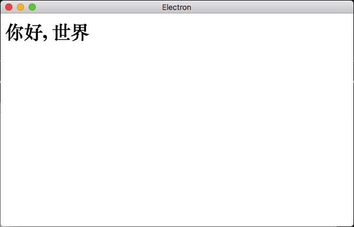
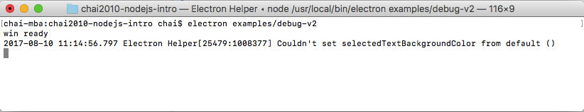
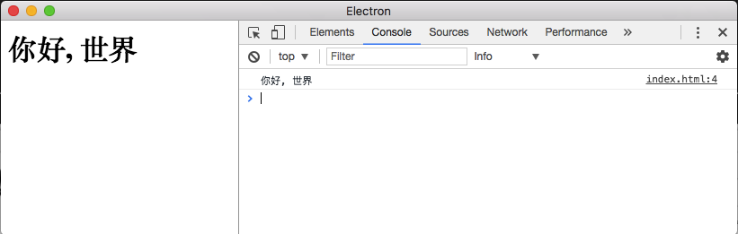
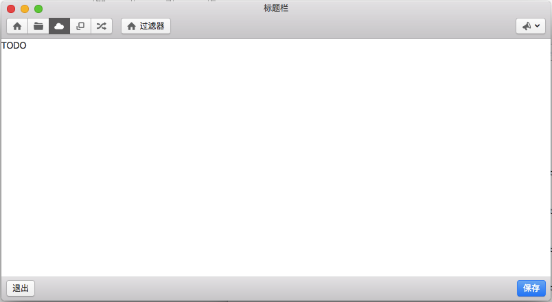

<!--
// Copyright 2016 ChaiShushan <chaishushan{AT}gmail.com>. All rights reserved.
// Use of this source code is governed by a BSD-style
// license that can be found in the LICENSE file.
-->

<!-- ======================================================================  -->

<!-- **** 横向分隔, ---- 竖向分隔, ___ 水平线, >Note: 讲稿注释  -->

<!--
Reveal.js 可能会需要 AJAX 异步加载 Markdown 文件, 可以在当前目录启动一个 http 服务.

以下是常见的临时启动 http 服务器的方式:

	NodeJS
	npm install http-server -g
	http-server

	Python2
	python -m SimpleHTTPServer

	Python3
	python -m http.server

	Golang
	go run server.go

启动后, 本地可以访问 http://127.0.0.1:port, 其中 port 为端口号, 命令行有提示.

幻灯片操作: F键全屏, S键显示注解, ESC大纲模式, ESC退出全屏或大纲模式, ?显示帮助

-->

<!-- ======================================================================  -->

# Node.JS & Electron 简介

<h4 style="text-align:center;">
	<a href="https://github.com/chai2010" target="_blank">
		chaishushan@gmail.com
	</a>
</h4>

>Note: 讲稿注释

<!-- ======================================================================  -->
****

## Node.JS 是什么?
_____________

- Node.JS 是不依赖浏览器的独立的 JavaScript 引擎
- 支持模块化的 JavaScript 编程
- 标准库: 文件系统, 网络, ...
_____________

- 网站: http://nodejs.org
- 安装: 安装包安装

<!-- ======================================================================  -->
****

## Electron 是什么?
_____________

- Node.JS 是一个命令行 JS 引擎
- Electron 则是一个支持 GUI 的 JS 引擎
- Electron 在 Node.JS 的基础上增加了对 Chrome 的支持
- Electron 是 Node.JS 的超集
_____________

- Electron 将 Node.JS 的标准库带入了 Chrome 中
- Electron 将 Node.JS 的模块化编程带入了 Chrome 中
_____________

- 网站: https://github.com/electron/electron
- 安装: `npm install electron -g`
- 镜像: https://npm.taobao.org

<!-- ======================================================================  -->
****

## 你好, 世界
_____________

examples/hello-v1.js:

```js
console.log('你好, 世界')
```
_____________

- Node.JS: `node examples/hello-v1.js`
- Electron: `electron examples/hello-v1.js`
_____________

- Node.JS 执行完成后退出了(命令行程序默认方式)
- Electron 执行完成后没有退出(GUI程序默认方式)

<!-- ======================================================================  -->
****

## 你好, 世界 - V2
_____________

examples/hello-v2.js:

```js
console.log('你好, 世界')
process.exit(0)
```
_____________

- process 是 NodeJS 内置的表示当前进程的对象
- 打印完成后调用 `process.exit(0)` 主动退出
- Node.JS 和 Electron 运行效果一致
_____________

- Node.JS 和 Electron 其实是类似的工具
- Electron 只是标准库比 Node.JS 多一些包而已


<!-- ======================================================================  -->
****

## 你好, 世界 - V3
_____________

examples/hello-v3/index.js:

```js
const electron = require('electron')

electron.app.on('ready', () => {
	let win = new electron.BrowserWindow()
	win.loadURL(`file:///${__dirname}/index.html`)
})
```
_____________

examples/hello-v3/index.html:

```html
<h1>你好, 世界</h1>
```
_____________

- Electron 运行: `electron examples/hello-v3`

<!-- ----------------------------------------------------------------------  -->
----

## 读懂代码
_____________

```js
// 用 Node.JS 提供的 require 函数加载 electron 包
// 加载的 electron 包对象赋值给名为 electron 常量
const electron = require('electron')

// electron.app 通过 electron 常量引用 electron 包中的 app 对象
// app 对象有一个 on 方法, 用于注册各种消息处理函数
// ready 消息在 app 对象准备就绪之后由 electron 框架发出
// 然后触发我们转入的消息处理函数...
electron.app.on('ready', () => {
	// 创建一个浏览器窗口, 保持到 win 局部变量中
	let win = new electron.BrowserWindow()

	// 这个新创建的浏览器窗口加载当前目录下的 index.html 页面
	// 其中 __dirname 是 Node.JS 引入的特性, 表示当前js源文件所在目录
	win.loadURL(`file:///${__dirname}/index.html`)
})
```
_____________

- 提示: 代码藏有BUG...


<!-- ----------------------------------------------------------------------  -->
----

## 运行预览
_____________

 <!-- .element: style="width:100%; height:500px;" -->

<!-- ----------------------------------------------------------------------  -->
----

## 改进: 避免 win 被提前回收
_____________

```js
const electron = require('electron')

let win = null

electron.app.on('ready', () => {
	if(win == null) {
		win = new electron.BrowserWindow()
		win.loadURL(`file:///${__dirname}/index.html`)
	}
})
```
_____________

- `win` 改为模块级变量


<!-- ======================================================================  -->
****

## 调试JS程序
_____________

- 写程序不会调试等于开车没有刹车, 迟早出问题
- 调试本质是根据程序的输入和输出分析问题
- 最前沿的调试技术: `console.log`
- 最古老的调试技术: `printf`


<!-- ----------------------------------------------------------------------  -->
----

## 调试 Node.JS 程序
_____________

examples/debug-v1.js

```js
function add(a, b) { return a+b }

console.log('add(1, 2):', add(1, 2))

// Output:
// add(1, 2): 3
```
_____________

- 通过 `console.log` 的输出分析程序的状态
- `console.log` 支持可变参数, 参数可以是任意类型


<!-- ----------------------------------------------------------------------  -->
----

## 调试 Electron 程序 - 01
_____________

examples/debug-v2/index.js

```js
const electron = require('electron')

let win = null

electron.app.on('ready', () => {
    if(win == null) {
        win = new electron.BrowserWindow()
		win.webContents.openDevTools() // <-- 调试代码

        win.loadURL(`file:///${__dirname}/index.html`)

		console.log('win ready') // <-- 调试代码
    }
})
```
_____________

- 浏览器窗口创建后打印 'win ready'


<!-- ----------------------------------------------------------------------  -->
----

## 调试 Electron 程序 - 02
_____________

examples/debug-v2/index.html

```html
<h1>你好, 世界</h1>

<script>
console.log('你好, 世界')  // <-- 调试代码
</script>
```
_____________

- 页面加载后打印 '你好, 世界'


<!-- ----------------------------------------------------------------------  -->
----

## 调试 Electron 程序 - 03
_____________

- index.js 和 index.html 属于不同运行空间!!!
_____________

- index.js 在执行 electron 命令的命令行打印消息
- index.html 在加载现实 html 页面的浏览器打印消息
_____________

- 浏览器的调试窗口可以看到打印输出
- 可以手工打开浏览器调试窗口, 也可以通过代码打开

<!-- ----------------------------------------------------------------------  -->
----

## 调试 Electron 程序 - 04
_____________

 <!-- .element: style="width:100%; height:150px;" -->

 <!-- .element: style="width:100%; height:250px;" -->


<!-- ----------------------------------------------------------------------  -->
----

## 调试代码的维护
_____________

- 单元测试
- 模块化
- ...


<!-- ======================================================================  -->
****

## 网页程序的限制
_____________

- 通用的浏览器为了安全, 禁止JS直接操作本地文件
- Electron 集成了 Node.JS 标准库, 没有限制


<!-- ----------------------------------------------------------------------  -->
----

## 网页中导入 fs 模块
_____________

examples/hello-v4/index.html

```html
<h1>你好, 世界</h1>
<script>
const fs = require('fs')

let now = new Date()
fs.writeFileSync(`${__dirname}/_time.txt`, now.toString())
</script>
```
_____________

- require 依然有效
- Electron 集成了 Node.JS 的标准库
- 导入 fs 模块操作文件


<!-- ----------------------------------------------------------------------  -->
----

## 网页中启动其它进程 - 01
_____________

examples/hello-v5/index.html

```html
<script>
const child_process = require('child_process')

let n = 100
let data = child_process.execSync(`node ${__dirname}/sum.js ${n}`)
console.log(`sum(1+2+...${n}):`, data.toString())
</script>
```
_____________

- 导入 child_process 模块, execSync 同步执行进程
- 启动进程的命令: `node ${__dirname}/sum.js ${n}`
- 进程的命令行参数和标准输出


<!-- ----------------------------------------------------------------------  -->
----

## 网页中启动其它进程 - 02
_____________

examples/hello-v5/sum.js

```js
function sum(n) {
	let s = 0
	for(let i = 0; i <= n; i++) {
		s += i
	}
	return s
}
if(require.main === module) {
	let args = process.argv.splice(2)
	if(args.length > 0) {
		console.log(sum(args[0]|0))
	}
}
```
_____________

- `require.main === module` 主模块/导入模块
- `process.argv`: [node, sum.js, 其它命令行参数...]


<!-- ----------------------------------------------------------------------  -->
----

## JS的并发限制
_____________

- JS 是单线程的语言, 通过异步模式处理多种事物
- 或者child_process启动多进程, 然后跨进程通讯
- 如果想多线程的能力, 可手写C/C++模块


<!-- ======================================================================  -->
****

## Photon: 美化 Electron 应用
_____________

 <!-- .element: style="width:100%; height:400px;" -->
_____________

http://photonkit.com


<!-- ----------------------------------------------------------------------  -->
----

## Photon: 布局模板
_____________

examples/photon-v1/index.html

```html
<div class="window">
    <header class="toolbar toolbar-header">
		页眉部分
	</header>

	<div class="window-content">
		内容部分
	</div>

	<footer class="toolbar toolbar-footer">
		页脚部分
	</footer>
</div>
```
_____________

http://photonkit.com/getting-started/


<!-- ----------------------------------------------------------------------  -->
----

## Photon: Electron/jQuery 包 - 01
_____________

examples/photon-v1/index.html

```html
<script>
// 导入 Electron 模块
const electron = require('electron')

// Electron 包含了 Node.JS 模块特性
// jQuery 会自动转为 require 模块使用方式
const $ = require('./jquery-3.2.1.min.js')

// 界面加载完成
$(document).ready(() => {
    $('.window-content').text(`electron: ${process.versions.electron}`)
})
</script>
```
_____________

- 页面引入的 electron 包 和主进程是不同的包
- jquery 最好以 require 方式加载

<!-- ----------------------------------------------------------------------  -->
----

## Photon: Electron/jQuery 包 - 02
_____________

examples/photon-v1/index.html

```html
<script>
// 退出按钮
$('#btn-cancel').click(() => {
    alert('退出')

    // 向主进程发送退出消息
    electron.ipcRenderer.send('myapp', 'quit', 123, 'abc')
})

// 保存按钮
$('#btn-save').click(() => {
    alert('保存')
})
</script>
```
_____________

- 页面最好避免直接退出程序, 向主进程发送消息
- `electron.ipcRenderer` 进程间的通讯管道


<!-- ----------------------------------------------------------------------  -->
----

## Photon: Electron/jQuery 包 - 03
_____________

examples/photon-v1/index.js

```js
// 主进程监控退出消息
electron.ipcMain.on('myapp', (event, ...args) => {
    console.log('args:', ...args)

    if(args.length > 0 && args[0] == 'quit') {
        electron.app.quit()
    }
})
```
_____________

- `electron.ipcMain` 是管道在主进程的名字
- myapp 是自定义的消息名称
- 消息可以带参数


<!-- ======================================================================  -->
****

## 模块化编程
_____________

TODO


<!-- ======================================================================  -->
****

## html内联JS和模块化
_____________

TODO


<!-- ======================================================================  -->
****

## 参考资源

#### http://nodejs.org

#### https://github.com/electron/electron


<!-- ======================================================================  -->
****

## Thank you

#### [chaishushan@gmail.com](https://github.com/chai2010)

<!-- ======================================================================  -->
